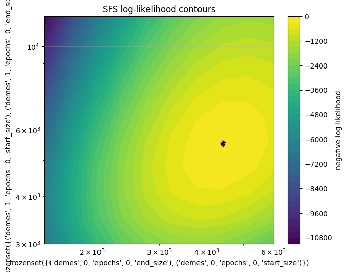

Optimization
========
This page demonstrates an end-to-end constrained optimization workflow with
``demesinfer``. It stands on its own, separate from the main tutorial.

This shows how to wire your model to SciPy's optimizer. It is *not* a
primer on numerical optimization. SciPy's API/behaviour can change across
versions — **We are not responsible for any updates/errors made to scipy.minimize.**

Requirements
------------

- Python 3.12+
- ``jax`` (CPU is fine)
- ``msprime>=1.3``
- ``scipy>=1.11``
- ``demesinfer``

Imports
-------

.. code-block:: python

   import numpy as np
   import jax
   import jax.numpy as jnp
   import msprime as msp
   from scipy.optimize import Bounds, LinearConstraint, minimize

   from demesinfer.sfs import ExpectedSFS
   from demesinfer.constr import EventTree, constraints_for
   from demesinfer.loglik.sfs_loglik import sfs_loglik

Revisiting the IWM model
------------------------

.. code-block:: python

   demo = msp.Demography()
   demo.add_population(initial_size=5000, name="anc")
   demo.add_population(initial_size=5000, name="P0")
   demo.add_population(initial_size=5000, name="P1")
   demo.set_symmetric_migration_rate(populations=("P0", "P1"), rate=0.0001)
   demo.add_population_split(time=1000, derived=["P0", "P1"], ancestral="anc")

   sample_size = 10
   samples = {"P0": sample_size, "P1": sample_size}
   ts = msp.sim_mutations(
       msp.sim_ancestry(
           samples=samples, demography=demo,
           recombination_rate=1e-8, sequence_length=1e8, random_seed=12
       ),
       rate=1e-8, random_seed=13
   )

   afs_samples = {"P0": sample_size * 2, "P1": sample_size * 2}
   afs = ts.allele_frequency_spectrum(
       sample_sets=[ts.samples([1]), ts.samples([2])],
       span_normalise=False,
   )

Inspecting and Selecting Parameters to optimize
--------------------------------------

Now that you have everything set up from the simulation, inspect the parameters you can work with:

.. code-block:: python    
    et = EventTree(demo.to_demes())
    et.variables

The variables are shown below; some are grouped in a ``frozenset`` to indicate parameters that must be optimized together. 
If you're unfamiliar with the grouping we use here, see the Tutorial and Notation section.

.. code-block:: python

    [frozenset({('demes', 0, 'epochs', 0, 'end_size'),
                ('demes', 0, 'epochs', 0, 'start_size')}),
    frozenset({('demes', 1, 'epochs', 0, 'end_size'),
                ('demes', 1, 'epochs', 0, 'start_size')}),
    frozenset({('demes', 2, 'epochs', 0, 'end_size'),
                ('demes', 2, 'epochs', 0, 'start_size')}),
    ('demes', 1, 'proportions', 0),
    ('demes', 2, 'proportions', 0),
    ('migrations', 0, 'rate'),
    ('migrations', 1, 'rate'),
    frozenset({('demes', 0, 'epochs', 0, 'end_time'),
                ('demes', 1, 'start_time'),
                ('demes', 2, 'start_time'),
                ('migrations', 0, 'start_time'),
                ('migrations', 1, 'start_time')}),
    frozenset({('demes', 1, 'epochs', 0, 'end_time'),
                ('demes', 2, 'epochs', 0, 'end_time'),
                ('migrations', 0, 'end_time'),
                ('migrations', 1, 'end_time')})]

Suppose now we wish to optimize the following parameters, their associated values will be the initial guesses in the optimization process:

.. code-block:: python

    paths = {frozenset({('demes', 0, 'epochs', 0, 'end_size'),
            ('demes', 0, 'epochs', 0, 'start_size')}):3000.,
        frozenset({('demes', 1, 'epochs', 0, 'end_size'),
            ('demes', 1, 'epochs', 0, 'start_size')}): 6000.,
        frozenset({('demes', 2, 'epochs', 0, 'end_size'),
            ('demes', 2, 'epochs', 0, 'start_size')}): 4000.}

Some parameters (e.g., migration rates) should be bounded. For instance, a (hypothetical) panmictic scenario with migration rate = 1 can explain the data equally well, 
so we typically restrict migration to a reasonable range such as (0, 1e-3). 

Constraints and bounds
----------------------

Use ``constraints_for`` to derive the linear constraints for your chosen
parameters. It returns a dict with:

- ``"eq"`` → ``(Aeq, beq)`` for equality constraints
- ``"ineq"`` → ``(G, h)`` for inequalities.

These map directly to SciPy's ``~scipy.optimize.LinearConstraint``:

.. code-block:: python

   cons = constraints_for(et, *path_order)  
   Aeq, beq = cons["eq"]
   G, h = cons["ineq"]

   linear_constraints = []
   if Aeq.size:
       linear_constraints.append(LinearConstraint(Aeq, beq, beq))

   if G.size:
       lower = -np.inf * np.ones_like(h, dtype=float)
       linear_constraints.append(LinearConstraint(G, lower, h))

   bounds = Bounds(lb=-np.inf * np.ones_like(x0), ub=np.inf * np.ones_like(x0))

Example Output:

.. code-block:: python

    {'eq': (array([], shape=(0, 3), dtype=float64), array([], dtype=float64)), 'ineq': (array([[-1., -0., -0.],
       [-0., -1., -0.],
       [-0., -0., -1.]]), array([0., 0., 0.]))}
    Bounds(array([-inf, -inf, -inf]), array([inf, inf, inf]))

Run the optimizer
-----------------

The final step is to construct an ``ExpectedSFS`` object and and the multinomial
log-likelihood.
Define the (negative log) likelihood, and use ``minimize`` with method ``trust-constr`` for constrained optimization.

.. code-block:: python

    esfs = ExpectedSFS(demo.to_demes(), num_samples=afs_samples)

    neg_ll_and_grad = jax.value_and_grad(
        lambda vec: -sfs_loglik(
            afs,
            esfs({k: vec[i] for i, k in enumerate(path_order)}),
            sequence_length=None, theta=None
        )
    )

    fun = lambda x: float(neg_ll_and_grad(jnp.asarray(x, dtype=jnp.float64))[0])
    jac = lambda x: np.asarray(neg_ll_and_grad(jnp.asarray(x, dtype=jnp.float64))[1], dtype=float)
    
    res = minimize(
        fun=lambda x: float(neg_loglik(x)[0]),
        x0=jnp.asarray(x0),
        jac=lambda x: jnp.asarray(neg_loglik(x)[1], dtype=float),
        method="trust-constr",
        bounds = bounds,
        constraints=linear_constraints,
        options={
        'gtol': 1e-4,
        'xtol': 1e-4, #default 1e-8
        'maxiter': 200, #default 1000
        'barrier_tol': 1e-4
        }
    )

To inspect our final estimates:

.. code-block:: python

    estimates = {k: float(res.x[i]) for i, k in enumerate(path_order)}
    estimates

For the simulated example, the estimates are close to the true values:

.. code-block:: python

    {frozenset({('demes', 0, 'epochs', 0, 'end_size'),
            ('demes', 0, 'epochs', 0, 'start_size')}): 4639.92038212473,
    frozenset({('demes', 1, 'epochs', 0, 'end_size'),
                ('demes', 1, 'epochs', 0, 'start_size')}): 5240.446822062476,
    frozenset({('demes', 2, 'epochs', 0, 'end_size'),
                ('demes', 2, 'epochs', 0, 'start_size')}): 4778.229908898697}

This full pipeline is wrapped in a single fit function. See the API reference for available options and implementation details.

Visualizing the log-likelihood Landscape
--------------------------------------

One of the way to visualize this optimization process is to plot the log-likelihood surface
with a contour plot.

The basic idea is simple, we pick two parameters to scan over a grid, 
and for each grid point, we evaluate the log-likelihood and compile them to be plotted into a contour plot.

.. code-block:: python

    p1_key = frozenset({('demes', 0, 'epochs', 0, 'end_size'),
            ('demes', 0, 'epochs', 0, 'start_size')})
    p2_key = frozenset({('demes', 1, 'epochs', 0, 'end_size'),
            ('demes', 1, 'epochs', 0, 'start_size')})

    base = dict(paths)
    p1_center = float(base[p1_key])
    p2_center = float(base[p2_key])

    N1, N2 = 10, 10
    span = 2.0
    p1_vals = jnp.logspace(jnp.log10(p1_center/span), jnp.log10(p1_center*span), N1)
    p2_vals = jnp.logspace(jnp.log10(p2_center/span), jnp.log10(p2_center*span), N2)

    Z = np.full((N2, N1), np.nan, dtype=float)

    for i in range(N2):       
        p2 = float(p2_vals[i])
        for j in range(N1):   
            p1 = float(p1_vals[j])
            g = dict(base)
            g[p1_key] = jnp.asarray(p1, dtype=jnp.float64)
            g[p2_key] = jnp.asarray(p2, dtype=jnp.float64)

            x_vec = jnp.asarray([g[k] for k in path_order], dtype=jnp.float64)
            
            e_full = esfs(g)
            ll = sfs_loglik(afs, e_full, sequence_length=None, theta=None)
            Z[i, j] = float(ll)

    Z_dLL = Z - np.nanmax(Z)

    X, Y = np.meshgrid(np.asarray(p1_vals), np.asarray(p2_vals), indexing="xy")
    plt.figure(figsize=(7, 5.5))
    cs = plt.contour(X, Y, Z_dLL, levels=[-10, -5, -2, -1, -0.5, -0.2, -0.1], colors='black')
    plt.clabel(cs, inline=True, fontsize=8)
    cf = plt.contourf(X, Y, Z_dLL, levels=40, cmap='viridis')
    plt.colorbar(cf, label='negative log-likelihood')

    plt.xscale('log'); plt.yscale('log')
    plt.xlim(float(p1_vals.min()), float(p1_vals.max()))
    plt.ylim(float(p2_vals.min()), float(p2_vals.max()))
    plt.xlabel(str(p1_key))
    plt.ylabel(str(p2_key))
    plt.title('SFS log-likelihood contours')
    plt.grid(True, alpha=0.3)
    plt.tight_layout()
    plt.show()

